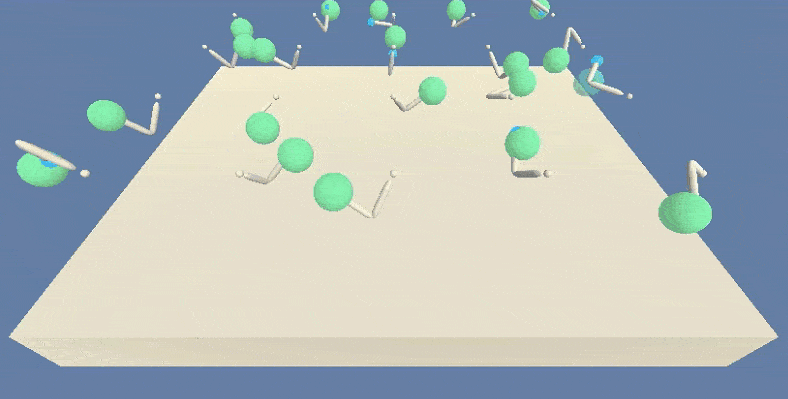

### Udacity Deep Reinforcement Learning Nanodegree:

# Project 2: Continuous Control


## Introduction

Let there be an agent with a double-jointed arm. The goal of the agent is to reach out to a target sphere and keep its "hand" within that sphere as long as possible. To reach its goal, the agent can apply torque to each of the two joints in 3D space.

The project is based on Unity's Reacher environment.





## Project Details

#### Project Environment
The project is implemented as a 4 layer neural network. The network is specified in the file `model.py`. The agent is implemented in the file `ddpg_agent.py`, and the notebook `Continuous Control UniModel.ipynb` provides the interactive code to train an untrained agent. 

#### State Space
The agent's observation space has 33 dimensions, and each feature vector describes an observation of the following 11 components, each in 3D:
- Link 1:
  - local position
  - rotation
- Spherical joint 1
  - angular velocity
  - velocity
- Link 2:
  - local position
  - rotation
- Spherical joint 2
  - angular velocity
  - velocity
- Target
  - local position
  - velocity
- Hand
  - local position

The input layer, thus, has 33 neurons with continuous input values. 

#### Action Space
The action space has 4 dimensions corresponding to polar and azimuthal torque for each of the two spherical joints with values pre-clamped and clipped to the interval $[-1, +1]$

#### Rewards
A reward of $+0.1$ is provided for each time step the agent's hand is within the target sphere, no negative reward or punishment is used otherwise.

#### Goal
The task is episodic. The agent must get an average score of $30$ over 100 consecutive episodes.


## Getting Started
The repository was developed and tested in a 64-bit Windows 10 virtual machine running Ubuntu 18.04 on an Intel Core i7-7700 CPU with dual NVIDIA GeForce GTX 1080.  

Unfortunately, the GPU passthrough for the cirtual machine could not be activated, and the CPU had to do all the work.

#### Dependencies
The same virtual environment as in project 1 was used.

#### Udacity Project Repository
Download the [project's repository](https://github.com/udacity/deep-reinforcement-learning/tree/master/p2_continuous_control) from Udacity's GitHub page if you like to re-implement the project yourself.
The Linux environment can be downloaded [here](https://s3-us-west-1.amazonaws.com/udacity-drlnd/P2/Reacher/one_agent/Reacher_Linux.zip) for 1 or  [here](https://s3-us-west-1.amazonaws.com/udacity-drlnd/P2/Reacher/Reacher_Linux.zip) for 20 agents. The project's GitHub page contains links to download it for operating systems other than Linux.

## Instructions
Make sure the `Reacher.x86_64` and the folder `Reacher_Data` from your environment are in your project directory, together with the `model.py`,  the `ddpg_agent.py`,  the `training.py`, and the `utils.py` files and the `Continuous Control UniModel.ipynb` notebook:
```text
A01/Reacher_Data
A01/Reacher.x86_64
A20/Reacher_Data
A20/Reacher.x86_64
Continuous Control Multimodel.ipynb
Continuous Control Synopsis.ipynb
Continuous Control UniModel.ipynbddpg_agent.py
ddpg_agent.py
model.py
readme.md
training.py
unity-environment.log
utils.py
```
The file `unity-environment.log` is (re-)created when running the notebook and does not exist initially.
A `result` folder may or may not exist. This is where trained models are stored, each in its own folder `model x` where x is an auto-incremented number.

Within the model folder, the following files are stored:

```
checkpoint_actor.pth
checkpoint_critic.pth
config.json
scores.csv
scores.png
```
The `pth` checkpoint files can be used to run a trained agent. The `json` file contains the model parameters used to train the agent plus the count of episodes needed to reach the target of 30. The `csv` file contains the raw score per episode, the moving average and the standard deviation calculated over a window of 100 (or less, as long as not enough episodes had been run to fill the window). Finally, a plot of the raw score, the moving average and the $\pm1$ standard deviation band around it is saved as a `png`.


#### Running the Code
To start the notebook server, open a terminal and navigate to your project directory or a parent thereof, then enter
```commandline
jupyter notebook
```
The jupyter environment is opened in your standard browser. You might have to navigate to the project directory, then start `Continuous Control UniModel.ipynb` to train a specific model. Run theindividual cells in sequence by clicking `SHIFT ENTER` in each or restart and run the kernel through the menu.

#### Overriding the Default Configuration
The configuration is predefined in the `utils.py` file. The number of agents, the hidden layer depth and various other model parameters can be overriden.

#### Training 20 Agents
Instantiate the `Config` object with the number of agents your want to train (`1` or `20`) and override, for example, the `fc1_units`, `fc2_units`, and the `gamma` value.  If you want your model to be stored in a specific `model x` folder where you specify `x`, set the `model_id_auto` to `false` and set `model_id` to `x`. This will create a model directory within the `results` folder.

The configuration is then printed. An Agent object is instantiated using the configuration, and the scores, moving average and the standard deviation values are created by the `ddpg` method imported from the file `training.py`. These values are then plotted and the plot saved as a `png` together with the checkpoint files for actor and critic plus the `csv` file of the values in the model directory. 
